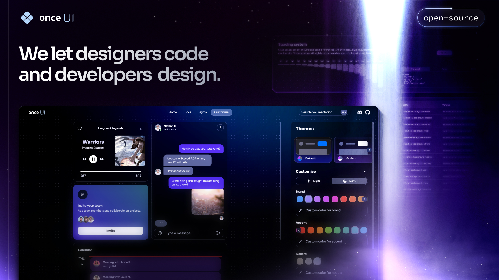

# **Portfolio Website**

A modern, responsive portfolio website built with Next.js.
 

Features: 
* **Modern Design** with a clean and professional look
* **Responsive Layout** that works seamlessly across all devices
* **Interactive Elements** for enhanced user experience
  

# **Getting Started**
Clone the repository and run `npm install` to get started.
  

# **License**
Distributed under the MIT License. See `LICENSE.txt` for more information.
  

# **Deploy your project**

